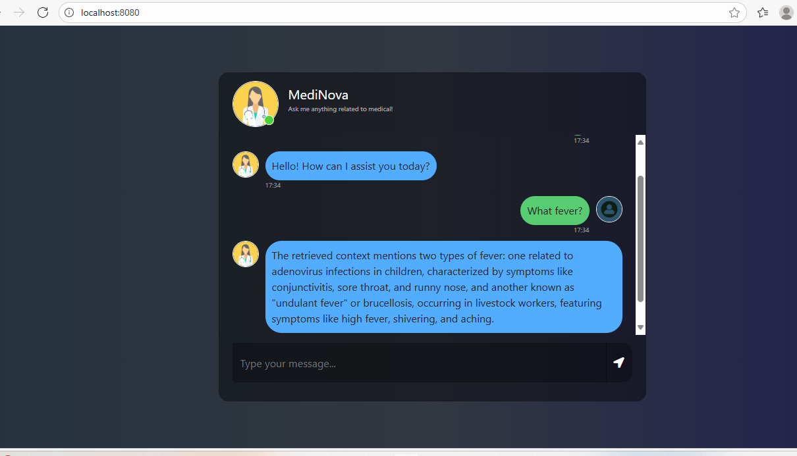

### MediNova



### 🚀 Introducing MediNova – My First Medical Chatbot

### I’m excited to share a project I’ve been working on — MediNova, an AI-powered medical chatbot designed to provide quick, reliable responses to healthcare-related queries.

### What makes MediNova special? It’s not just another chatbot. It’s built with:
### ✅ RAG (Retrieval-Augmented Generation) for precise, context-aware answers 
### ✅ LangChain + LangGraph to orchestrate intelligent workflows
### ✅ LangSmith for monitoring and debugging conversations
### ✅ VectorDB (Pinecone) for efficient, semantic memory storage
### ✅ Hugging Face + OpenAI models for natural, human-like interaction

### 💡 The vision:
MediNova aims to bridge the gap between healthcare information and accessibility — helping users get quick responses on medical queries while ensuring the data is contextual and structured for future insights.

For me, building MediNova has been an incredible journey of learning and experimenting with the power of GenAI + agentic frameworks.
### STEP 00- Clone the repository

https://github.com/akhileshtrivedi/Medical-Chatbot-Pinecone.git

### STEP 01- Create a virtual environment after opening the repository

```bash
python -m venv medicalhenv
```

```bash
medicalhenv\Scripts\activate  
```


### STEP 02- install the requirements
```bash
pip install -r requirements.txt
```


### Create a `.env` file in the root directory and add your Pinecone & openai credentials as follows:

```ini
PINECONE_API_KEY = "xxxxxxxxxxxxxxxxxxxxxxxxxxxxx"
OPENAI_API_KEY = "xxxxxxxxxxxxxxxxxxxxxxxxxxxxx"
```


```bash
# run the following command to store embeddings to pinecone
python store_index.py
```

```bash
# Finally run the following command
python app.py
```

Now,
```bash
open up localhost:
```

### Thanks